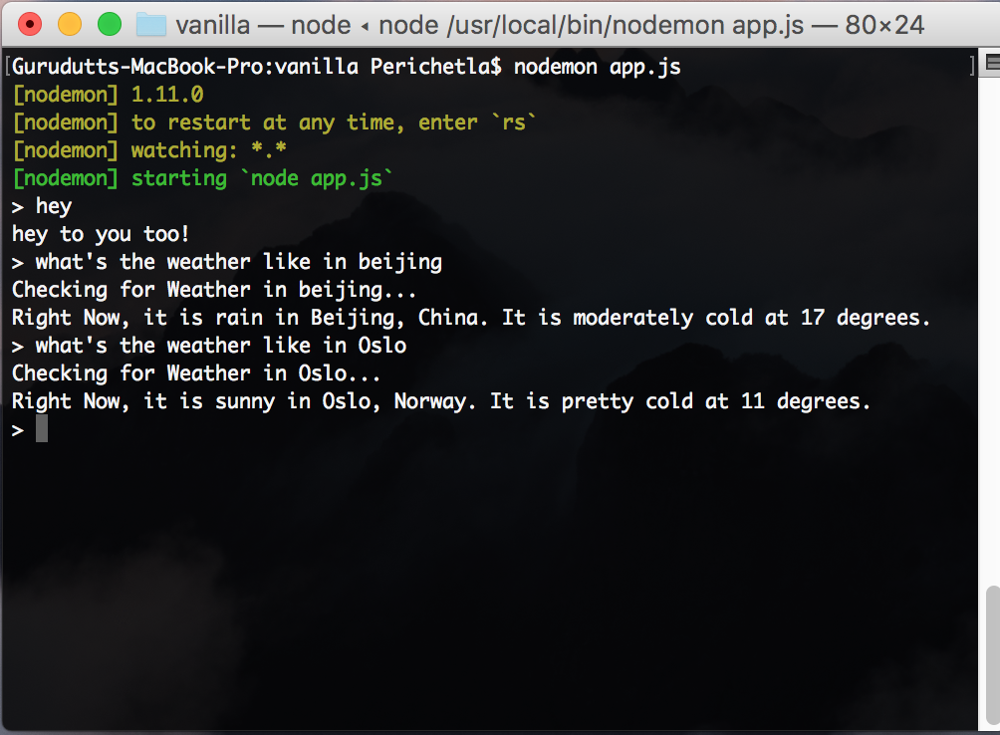

# vanilla

Vanilla is a simple Weather Bot that runs in Terminal. It was developed using Node.js and Yahoo's Weather API.
I used YQL, Yahoo's Structured Query Language to retrieve geolocation data, and find each place's "Where on Earth ID" to get details weather such as weather and temperature.

I used Nodemon for running the bot, and used XRegExp to get patterns in the user's input string by converting the string to Regular Expressions.

